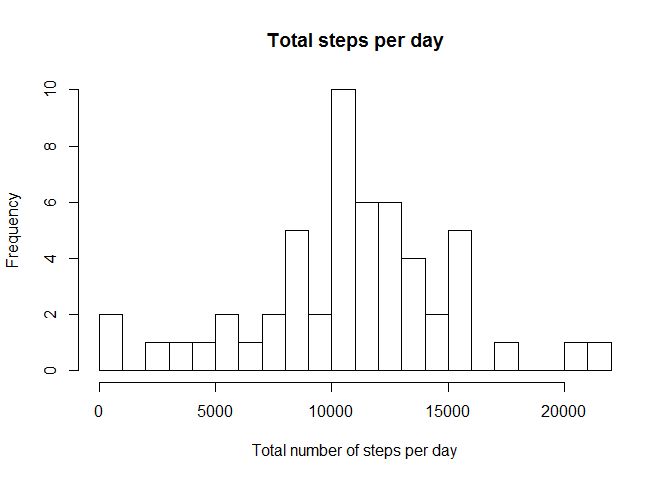

# Reproducible Research: Peer Assessment 1

## Load Packages 
Simply load in the packeges I prefer using.

```r
library("dplyr", lib.loc="~/R/win-library/3.1")
```

```
## 
## Attaching package: 'dplyr'
## 
## The following object is masked from 'package:stats':
## 
##     filter
## 
## The following objects are masked from 'package:base':
## 
##     intersect, setdiff, setequal, union
```

```r
library("ggplot2", lib.loc="~/R/win-library/3.1")
```

## Loading and preprocessing the data

This asumes the file contaning the data is in the working directry and that the data is in a folder called "activity.csv"


```r
activity<-read.csv(file = "activity.csv")
activity[[2]]<-as.Date(activity[[2]],"%Y-%m-%d")
str(activity)
```

```
## 'data.frame':	17568 obs. of  3 variables:
##  $ steps   : int  NA NA NA NA NA NA NA NA NA NA ...
##  $ date    : Date, format: "2012-10-01" "2012-10-01" ...
##  $ interval: int  0 5 10 15 20 25 30 35 40 45 ...
```

## What is mean total number of steps taken per day?


### 1 Calculate the total number of steps taken per day

```r
activity_by_date<-group_by(activity,date)
steps_per_day<-summarise(activity_by_date,steps=sum(steps))
print(steps_per_day)
```

```
## Source: local data frame [61 x 2]
## 
##          date steps
## 1  2012-10-01    NA
## 2  2012-10-02   126
## 3  2012-10-03 11352
## 4  2012-10-04 12116
## 5  2012-10-05 13294
## 6  2012-10-06 15420
## 7  2012-10-07 11015
## 8  2012-10-08    NA
## 9  2012-10-09 12811
## 10 2012-10-10  9900
## ..        ...   ...
```
### 2 Make a histogram of the total number of steps taken each day

```r
hist(steps_per_day[[2]],breaks = 20,xlab = "Total number of steps per day",main = "Total steps per day")
```

 


### 3 Calculate and report the mean and median of the total number of steps taken per day.


```r
mean<-mean(steps_per_day[[2]],na.rm = T)
median<-median(steps_per_day[[2]],na.rm = T)
```
The mean number of steps is 1.0766189\times 10^{4} and the median is 10765. 

## What is the average daily activity pattern?

### 1 Make a time series plot of steps and time interval

```r
activity_by_interval<-group_by(activity,interval)
steps_per_interval<-summarise(activity_by_interval,steps=mean(steps,na.rm = TRUE))
with(steps_per_interval,plot(x = interval,y = steps,type = "l",xlab = "interval in min.",ylab = "mean number of steps"))
```

 

### 2 Which 5-minute interval, on average across all the days in the dataset, contains the maximum number of steps

```r
filter(steps_per_interval,steps==max(steps))
```

```
## Source: local data frame [1 x 2]
## 
##   interval    steps
## 1      835 206.1698
```


## Imputing missing values

### 1 Calculate and report the total number of missing values in the dataset


```r
sum(is.na(activity))
```

```
## [1] 2304
```
### 2 & 3 Devise a strategy for filling in all of the missing values in the dataset and creat a new data set.

I combind thease two steps as it was easior to rite the code and think about the problem (or at least it was for me).

```r
activity_na<-activity

for(i in 1:nrow(activity_na)){
  if(is.na(activity_na[i,1])==TRUE){
    activity_na[i,1]<-as.integer(filter(steps_per_interval,interval==activity_na[i,3])[1,2])
  }
}

head(activity_na)
```

```
##   steps       date interval
## 1     1 2012-10-01        0
## 2     0 2012-10-01        5
## 3     0 2012-10-01       10
## 4     0 2012-10-01       15
## 5     0 2012-10-01       20
## 6     2 2012-10-01       25
```


### 4 Make a histogram of the total number of steps taken each day and Calculate and report the mean and median total number of steps taken per day.
Replacing the NA's with the mean of the time interval did not have a massive effect , although there was some change particularly in the group taking 1000 steps in a day.

```r
activity_by_date_na<-group_by(activity_na,date)
steps_per_day_na<-summarise(activity_by_date_na,steps=sum(steps))
hist(steps_per_day_na[[2]],breaks = 20,xlab = "Total number of steps per day",main = "Total steps per day NA's set to the mean of time interval")
```

 
  


```r
mean<-mean(steps_per_day_na[[2]])
median<-median(steps_per_day_na[[2]])
```

The mean number of steps is 1.074977\times 10^{4} and the median is 10641.
The mean decreaced by 124 steps and the median 17 steps. Given that the median is aprocsomaitly 10766 the 17 steps is a 0.15% difference.


## Are there differences in activity patterns between weekdays and weekends?

### 1 Create a new factor variable in the dataset indicating whether a given date is a weekday or weekend day

```r
activity_na<-mutate(activity_na,day=factor(weekdays(date)))

weekend<-c("Saturday","Sunday")

activity_na<-mutate(activity_na,day=factor(day %in% weekend,levels=c(F,T),labels=c("weekday","weekend")))
head(activity_na)
```

```
##   steps       date interval     day
## 1     1 2012-10-01        0 weekday
## 2     0 2012-10-01        5 weekday
## 3     0 2012-10-01       10 weekday
## 4     0 2012-10-01       15 weekday
## 5     0 2012-10-01       20 weekday
## 6     2 2012-10-01       25 weekday
```
### 2 Make a panel plot containing a time series plot of interval vs the mean number of steps sorted by weekday/end


```r
activity_by_interval_na<-group_by(activity_na,interval,day)
steps_per_interval_na<-summarise(activity_by_interval_na,steps=mean(steps,na.rm = TRUE))
g<-qplot(x=interval,y=steps,data=steps_per_interval_na,facets = day~. )
 g+geom_line()
```

 
